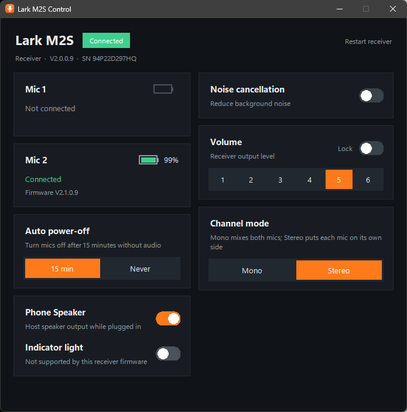

# Lark M2S Control

A Windows desktop app for the **Hollyland Lark M2S** wireless microphone. It gives you the
settings from Hollyland's HollyAudio phone app while the USB-C receiver is plugged into a PC.



Not affiliated with or endorsed by Hollyland. Use at your own risk.

## Features

- Receiver status, firmware version and serial number
- Mic 1 / Mic 2 connection, battery level and firmware version
- Noise cancellation on/off, Weak or Strong
- Volume 1–6 and volume lock
- Channel mode: Mono or Stereo
- Auto power-off: 15 min or Never
- Phone Speaker switch
- Indicator light (only on receiver firmware that supports it; V2.0.0.9 doesn't)
- Restart receiver
- Reconnects automatically when the receiver is unplugged or restarted
- Follows the Windows light/dark app theme

The app follows HollyAudio's rules: noise cancellation and channel mode need at least one
connected mic, and the volume can't be changed while it is locked.

Firmware updates are not supported. Use Hollyland's official updater for that.

## Run

Download `Lark M2S Control.exe` and double-click it. No driver or install is needed. The receiver
uses the standard Windows HID driver.

To run from source (Python 3.12):

```powershell
py -3.12 -m venv .venv
.venv\Scripts\pip install -r requirements.txt
.venv\Scripts\python app.py
```

## Build the .exe

```powershell
powershell -ExecutionPolicy Bypass -File build.ps1
```

The output is `dist\Lark M2S Control.exe`. `python make_icon.py` regenerates `assets\`.

`python diagnose.py` prints the receiver's status, versions and serial numbers without changing
anything.

## Tests

```powershell
.venv\Scripts\python -m tests.test_protocol   # offline
.venv\Scripts\python -m tests.live_check      # needs the receiver plugged in; read-only
```

## Protocol notes

Tested with a Lark M2S USB-C receiver (VID `0x3547`, PID `0x0405`, receiver firmware V2.0.0.9,
mic firmware V2.1.0.9). The camera receiver (PID `0x0406`) uses the same product family code but
is untested.

The receiver exposes several HID collections. Control traffic uses the vendor collection with
usage page `0xFF90`. Each message is a 64-byte report with report ID `0x55`:

```
host -> RX:  55 | AA DD cmd ctl lenHi lenLo payload... xor | zero padding
RX -> host:  55 | BB DD cmd ctl lenHi lenLo payload...     | zero padding
```

- `ctl` is `0x40 | device` in requests (0 = receiver, 1 = mic 1, 2 = mic 2). Replies use
  `0x80 | device`.
- `xor` is the XOR of all frame bytes before it. The receiver doesn't add one to replies.
- Set commands reply with payload `01` on success, except the noise toggle (see table).
- The receiver only sends reports in reply to a request, so poll the heartbeat (the app does
  once a second). Commands the firmware doesn't know get no reply.

| Cmd  | Name            | Request payload                   | Reply payload |
|------|-----------------|-----------------------------------|---------------|
| 0x10 | Heartbeat       | –                                 | see below |
| 0x03 | Get version     | – (ctl selects the device)        | 4 bytes, e.g. `02 00 00 09` = V2.0.0.9 |
| 0x15 | Get serial      | – (ctl selects the device)        | ASCII |
| 0x04 | Get volume      | –                                 | 0–5 |
| 0x05 | Set volume      | 0–5 (shown as 1–6)                | status |
| 0x06 | Set noise level | 1 = weak, 2 = strong              | status, level |
| 0x11 | Get noise level | –                                 | 0 = off, 1, 2 |
| 0x19 | Toggle noise    | `02`                              | `87` = now on, `07` = now off |
| 0x12 | Set Phone Speaker | 0 = on, 1 = off                 | status |
| 0x13 | Get Phone Speaker | –                               | 0 = on |
| 0x18 | Set channel mode | 0 = mono, 1 = stereo             | status |
| 0x34 | Set volume lock | 1 = locked, 0 = unlocked          | status |
| 0x35 | Get volume lock | –                                 | 0/1 |
| 0x36 | Set auto power-off | 0 = 15 min, 1 = never          | status |
| 0x39 | Set indicator light | 0 = on, 1 = off               | status (no reply on V2.0.0.9) |
| 0x0C | Restart receiver | –                                | – |

Heartbeat reply payload: `[0]` mic 1 connected, `[1]` mic 2 connected, `[2]` mic 1 battery %,
`[3]` mic 2 battery %, `[4..5]` level (unused), `[6]` noise, `[7]` volume, `[8]` volume lock,
`[9]` channel mode, `[10]` auto power-off. Newer firmware may append `[11..12]` custom-button
settings and `[13]` indicator light (0 = on). Firmware V2.0.0.9 sends only the first 11 bytes.
